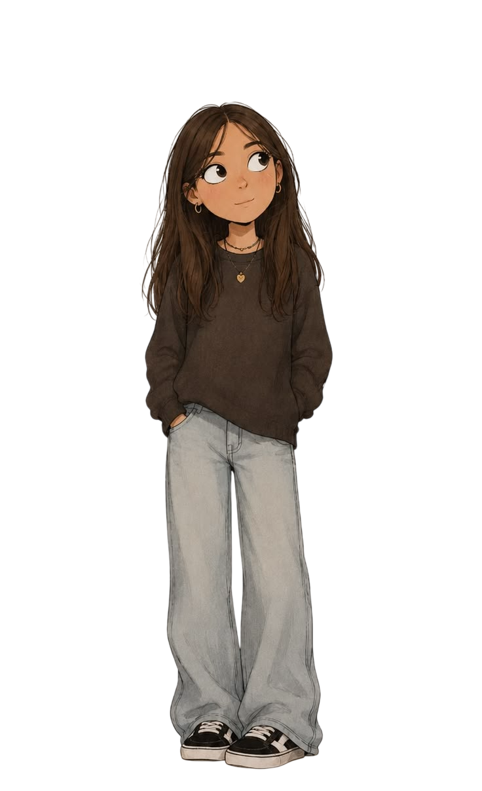

# Oiii, eu sou a Rachel

Sou estudante de Engenharia de Controle e Automação dedicada a resolver problemas e transformar lógica em aplicações reais. 

<table>
  <tr>
    <td valign="top" width="250">
      
    </td>
    <td valign="top">
      <h2>Sobre Mim</h2>
      <ul>
        <li><strong>Tenho experiência com:</strong> C/C++, Python, Programação Bare-Metal (ATmega328P-arduino), SolidWorks e Impressão 3D.</li>
        <li><strong>Atualmente explorando:</strong> Machine Learning, IA Generativa e Desenvolvimento Full-Stack.</li>
        <li><strong>Meus focos principais:</strong>
          <ul>
            <li>Desenvolvimento de código de baixo nível e otimização de memória.</li>
            <li>Pesquisa e inovação.</li>
            <li>Raciocínio matemático avançado.</li>
          </ul>
        </li>
        <li><strong>No tempo livre:</strong> Jogo xadrez, resolvo sudoku, dedico-me à leitura e gosto de cuidar de plantas.</li>
      </ul>
    </td>
  </tr>
</table>

## Habilidades

  
  
  
  
  
  
  

